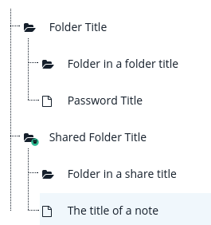

# Filetree structure

The filetree structure is the combined construct that is created by the client.
It contains folders and items where folders can contain more folders and items.


## Filetree as image



## Filetree as JSON
```json
{
  "datastore_id": "5fb571e3-8d08-42d6-8105-fee8f9a0099b",
  "folders": [
    {
      "id": "e0bdf385-653c-4b2f-b9be-390ef5f15e10",
      "name": "Folder Title",
      "folders": [
        {
          "id": "da40a0ab-dc4e-4828-91df-c67d2421bf25",
          "name": "Folder in a folder title"
        }
      ],
      "items": [
        {
          "id": "7b99c4ab-4703-402d-a927-cbdfb3935f5d",
          "type": "website_password",
          "urlfilter": "example.com",
          "name": "Password Title",
          "secret_id": "fc908def-104a-4d20-9ab0-6b8ea2908d30",
          "secret_key": "c9701d30feafe7aadfafa2465bfd4d0899b265fff9364d7dbbf05f312087de22"
        }
      ]
    },
    {
      "name": "Shared Folder Title",
      "share_secret_key": "725318c737d5a56552e71c0d90ac8f8a3b065b37da0191d6f9bbd68434deb6a9",
      "share_id": "a1b14805-1b5f-4b7e-a944-39d0eb4c6f76",
      "id": "3e1f432c-68fa-44c9-a6f6-fdfd36c6e359",
      "items": [
        {
          "id": "7a729bef-ac6f-4be2-927e-6fd6a7d761d1",
          "type": "note",
          "name": "The title of a note",
          "secret_id": "a5506eab-5f49-454e-a55f-d93954177354",
          "secret_key": "3c698b46479eacedcd421fcca9aeb6452c69cbb2c073b18a0aaec8112069d97e"
        }
      ],
      "folders": [
        {
          "id": "580665e1-f97e-418a-8ad2-b6a1d4dc7ae2",
          "name": "Folder in a share title",
          "folders": []
        }
      ]
    }
  ],
  "items": [],
  "share_index": {
    "a1b14805-1b5f-4b7e-a944-39d0eb4c6f76": {
      "paths": [
        [
          "3e1f432c-68fa-44c9-a6f6-fdfd36c6e359"
        ]
      ],
      "secret_key": "725318c737d5a56552e71c0d90ac8f8a3b065b37da0191d6f9bbd68434deb6a9"
    }
  }
}
```


## Reserved Keywords

Those keywords will be deleted on save and are helpers, which are used by the client temporary:

- parent_datastore_id
- parent_share_id
- share_rights
- expanded
